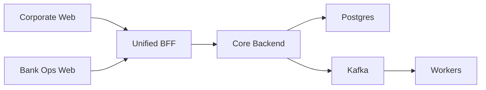

# CMS Banking Platform

This repository now follows the target runtime shape below:

## Runtime components

- `apps/corporate-web`: corporate-facing Next.js application
- `apps/bank-ops-web`: bank-operations-facing Next.js application
- `apps/bff`: unified Fastify BFF for both web surfaces
- `apps/api`: core backend with domain routes and orchestration
- `apps/worker`: background Kafka and projection worker
- `packages/shared`: config, database, Kafka, outbox, and tenant primitives

## What changed

- Corporate web no longer reaches the core backend directly for login or initial page aggregation.
- A dedicated `bff` app now fronts both browser surfaces.
- A dedicated `bank-ops-web` app now exists instead of treating bank tooling as an API-hosted browser surface.
- The bank-ops web surfaces now render as first-class Next.js pages rather than iframe wrappers around legacy HTML.
- The core backend no longer registers the legacy corporate browser routes.
- Workers and backend responsibilities remain behind Postgres and Kafka.

## Local run

1. Copy `.env.example` to `.env`
2. Install dependencies
3. Run database migrations with `npm run db:migrate`
4. Optionally load seed data with `npm run db:seed`
5. Start the core backend with `npm run dev:api`
6. Start the unified BFF with `npm run dev:bff`
7. Start the corporate web app with `npm run dev:corporate-web`
8. Start the bank ops web app with `npm run dev:bank-ops-web`
9. Start the worker with `npm run dev:worker`

## Default local ports

- `3100`: unified BFF
- `3101`: core backend
- `3102`: worker health endpoint
- `3001`: corporate web
- `3002`: bank ops web

## Helpful web env vars

- `BFF_URL`: corporate web server-side and local BFF target
- `CORE_API_URL`: BFF-to-core-backend target
- `NEXT_PUBLIC_BANK_OPS_WEB_URL`: corporate web links and embeds for the bank ops app

## Architectural notes

- The BFF owns web-facing aggregation and proxy concerns.
- The core backend owns domain APIs, business workflows, and persistence.
- Kafka plus workers continue to handle asynchronous publishing, projections, dispatch, and follow-up processing.
- The bank-ops UI now lives in `bank-ops-web` as first-class pages and still reaches backend capability only through the BFF.

## Database workflow

- SQL migrations live in [scripts/db/migrations](C:/Users/krgau/OneDrive/Documents/Projects/CMSV02/scripts/db/migrations)
- migration runner: `npm run db:migrate`
- seed runner: `npm run db:seed`

## Architecture Notes

- [HLD-01 Platform Foundation](C:/Users/krgau/OneDrive/Documents/Projects/CMSV02/docs/HLD-01-Platform-Foundation.md)
- [HLD-02 Event-Driven Transaction Pipeline](C:/Users/krgau/OneDrive/Documents/Projects/CMSV02/docs/HLD-02-Event-Driven-Transaction-Pipeline.md)
- [HLD-03 Web Edge Rearchitecture](C:/Users/krgau/OneDrive/Documents/Projects/CMSV02/docs/HLD-03-Web-Edge-Rearchitecture.md)
- [HLD-04 Package Architecture Migration Roadmap](C:/Users/krgau/OneDrive/Documents/Projects/CMSV02/docs/HLD-04-Package-Architecture-Migration-Roadmap.md)

## Core API examples

- `GET /health`
- `GET /context`
- `POST /v1/auth/login`
- `GET /v1/tenants/banks`
- `GET /v1/tenants/corporates`
- `GET /v1/onboarding/applications`
- `GET /v1/beneficiaries`
- `GET /v1/payouts/batches`
- `POST /v1/payouts/batches`
- `POST /v1/payouts/batches/:batchId/actions`
