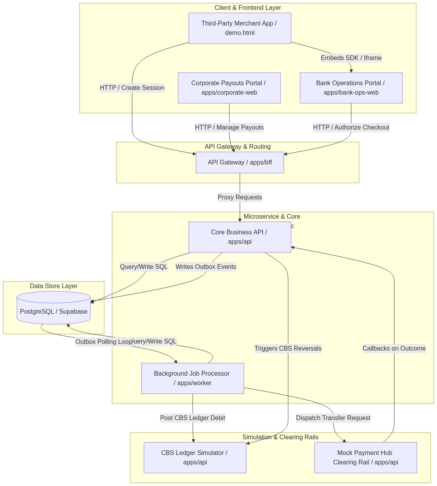
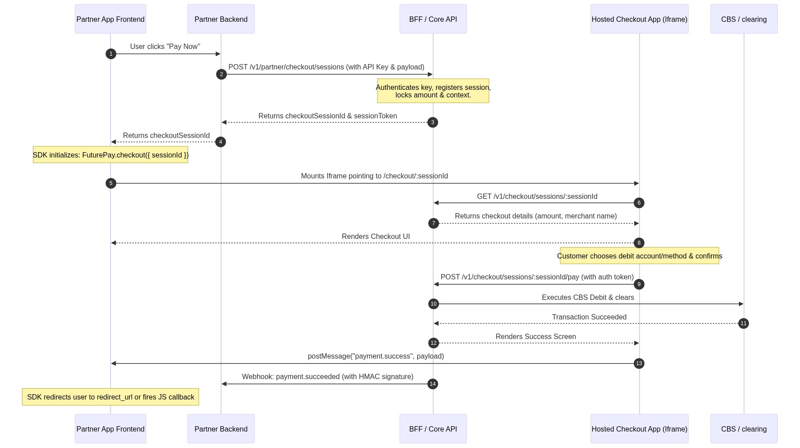
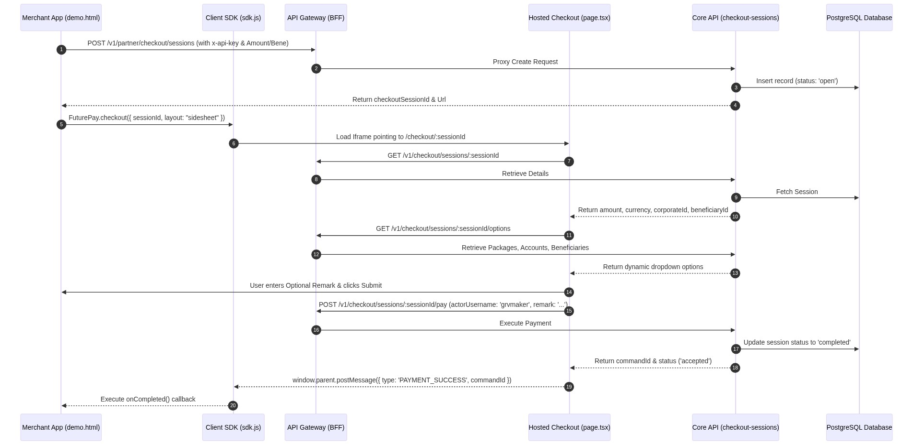
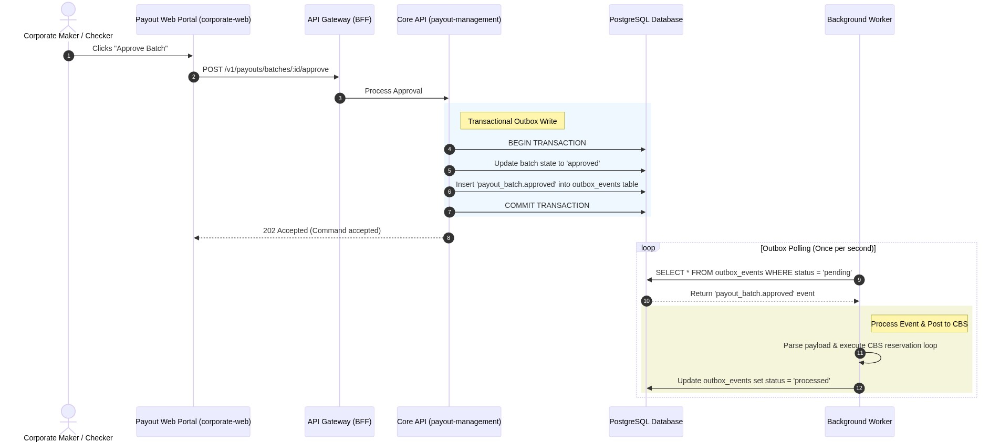
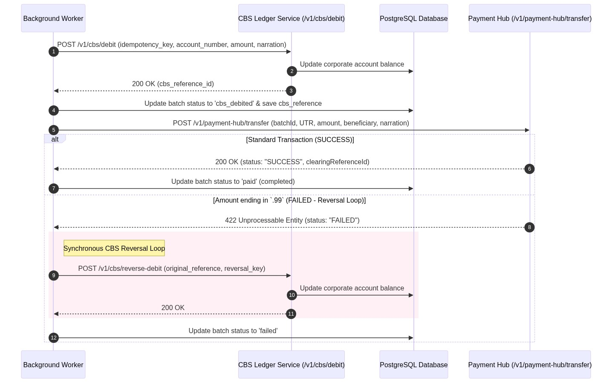
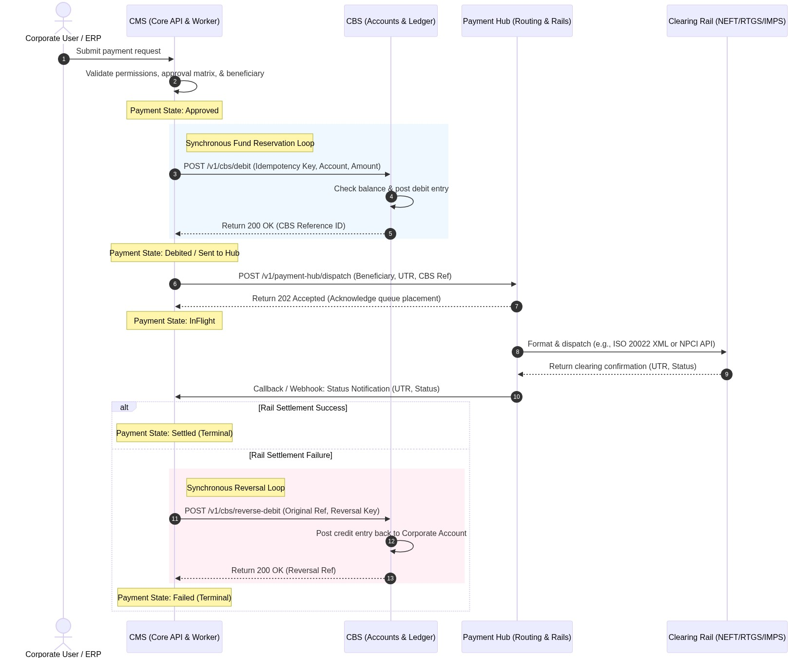
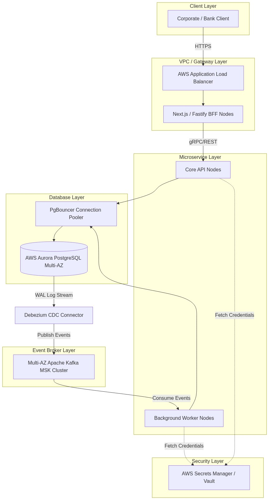

# FuturePay CMS V2.0 - Overall Product Architecture & Integrations

This document presents a comprehensive blueprint of the **FuturePay Cash Management System (CMS V2.0)** architecture. It breaks down the internal subsystems of our corporate banking platform, maps the dynamic data flows, and outlines all key integration patterns (including checkout session lifecycle, SDK side-sheets, maker-checker authorization, CBS debit ledger postings, and mock Payment Hub clearing outcomes).

---

## 1. High-Level Product Architecture

The system is built as a modular monorepo containing multiple stateless service layers, a shared PostgreSQL transactional database, and asynchronous message/event processing loops.

---

## 2. Monorepo Subsystem Breakdown

### A. Frontends
1. **Corporate Web (`apps/corporate-web`)**:
   - Next.js Single Page Application (SPA).
   - Designed for corporate clients to configure approval matrices, upload bulk payout files (Excel/CSV), manage single transactions, and view live ledger statements.
2. **Bank Operations Web (`apps/bank-ops-web`)**:
   - Next.js application hosting the Bank Portal and Developer Sandbox.
   - Hosts the **Hosted Checkout App** (`/checkout/[sessionId]`) that renders secure payment forms embedded inside partner merchant sites.
   - Serves the **Static JavaScript Client SDK** (`/v1/sdk.js`) loaded by external merchant applications.

### B. Core Services
1. **BFF Gateway (`apps/bff`)**:
   - Fastify HTTP proxy server acting as the single entry point.
   - Handles session cookie validation and role authorization.
   - Restricts routing access via whitelists to public API endpoints (e.g. `/v1/checkout/*`, `/v1/partner/*`, `/v1/cbs/*`) to allow public playground and iframe executions.
2. **Core API (`apps/api`)**:
   - Fastify application serving as the system's single source of truth for business logic.
   - Handles Payouts, Checkout Sessions, API Key generation, Subscription Matrices, and logs events directly to the database `outbox_events` table.
   - Contains simulator endpoints representing the **Core Banking System (CBS)** and the **Payment Hub Clearing Rails**.
3. **Background Worker (`apps/worker`)**:
   - Asynchronous execution engine.
   - Polls `outbox_events` to digest accepted payout batches.
   - Orchestrates the fund reservation workflow, executing Core Banking debit ledger adjustments, clearing rails dispatches, and processing reversals.

---

## 3. Client SDK Embedding & Side-sheet Flow

The Checkout SDK provides partners a secure way to embed payouts inside their applications. The partner backend registers a checkout session, then the SDK loads our checkout portal inside an iframe side-sheet overlay.

---

## 4. Secure Checkout Integration & Iframe Communication

The Checkout SDK uses secure, cross-document postMessage communications to synchronize iframe checkout operations with the parent application. It locks the authorizer user (`grvmaker`) and beneficiary (`SILLU`) dynamically in a secure, non-editable side-sheet panel.

---

## 5. Payout Batch Processing & Event Outbox Pipeline

The maker-checker authorization flow follows the Transactional Outbox Pattern to guarantee reliable, asynchronous transaction processing:

---

## 6. Core Banking (CBS) Fund Reservation & Payment Hub Simulation

Once a payout batch is approved, the background worker isolates financial mutations and dispatches clearing rail instructions. This decouples ledger accounting from network failures:

---

## 7. Real-World Indian Banking Single-Payment Settlement Flow

For production environments operating under the Indian Banking Paradigm (NEFT, RTGS, IMPS via NPCI), the system maps our asynchronous worker loops to decoupled stage-gate transaction pipelines. This mitigates clearing rail timeouts and coordinates real-time ledger reversals:

---

## 8. Target Enterprise Deployment Architecture

To scale FuturePay to Tier-1 banking requirements (PCI-DSS, multi-AZ high availability), we recommend upgrading database polling to Change Data Capture (CDC) with Debezium and introducing PgBouncer connection pooling:

---

## 9. Key Security, Idempotency & Resiliency Patterns

1. **Transactional Outbox Guarantee**:
   Entity state changes (such as approving a transaction) and domain event logging (`outbox_events`) are written within the same atomic SQL transaction block. This prevents situations where a transaction state changes but the worker is never notified, or vice versa.
2. **Idempotency Protection (CBS Ledger & Payout Workers)**:
   The worker queries the CBS transaction status API `GET /v1/cbs/transactions/status/:idempotencyKey` before dispatching updates. This pre-flight validation guarantees that network drops or duplicate event dispatches will never process double-payouts.
3. **API Authorization Bypasses**:
   Certain endpoint paths are whitelisted in `apps/bff/src/main.ts`:
   - `/v1/checkout/*` and `/v1/partner/*` paths allow API keys (`x-api-key`) or session identifiers to process checkouts directly from third-party sites without requiring standard corporate cookie sessions.
   - `/v1/cbs/*` and `/v1/payment-hub/*` bypass auth checks, enabling sandbox environments and workers to communicate directly.
4. **Clearing Outcome Control**:
   The Payment Hub mock simulator introduces a deterministic mechanism to test error correction flows: transactions with amounts ending in `.99` trigger failures. This triggers the CBS reversal loop, allowing developers to manually inspect failures and reversal records on the Corporate Portal and the Bank Operations Portal.
